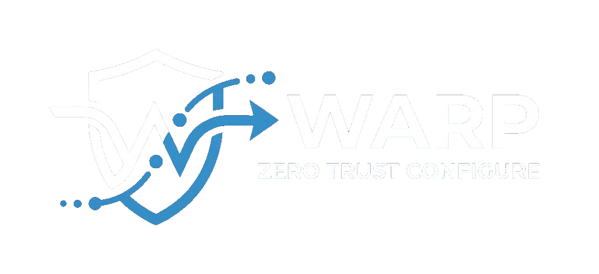

### Cloudflare WARP Zero Trust üzerinden engelli servislere tek tıkla, sorunsuz erişim.

---

**WARP Configurator**, internet servis sağlayıcılarının getirdiği kısıtlamaları (örneğin Discord, Roblox) aşarak **Cloudflare Zero Trust** altyapısı ile güvenli bir şekilde bağlanmanızı sağlayan açık kaynaklı bir araçtır. Kurulumu sadece birkaç dakika sürer ve tüm karmaşık teknik ayarları sizin yerinize arka planda halleder.

- **🚀 MASQUE Protokolü:** Bağlantınızı tamamen gizler ve tüneller.
- **⚡ Split Tunnel (Bölünmüş Tünel):** Sadece seçili uygulamalar (Discord vb.) WARP üzerinden geçer, genel internet hızınız ve oyunlardaki pinginiz etkilenmez.
- **🔄 Canlı Senkronizasyon:** Yaptığınız tüm ayarlar bulut ile anında eşzamanlanır.
- **🛡️ Otomatik Kural Güncellemeleri:** Discord ve Roblox gibi platformlar için en güncel IP/Domain listelerini hazır olarak barındırır.

---

## ⬇️ Kurulum 

1. [**Releases**](https://github.com/KULLANICI_ADI/REPO_ADI/releases) sayfasından en güncel **`WARP_Configurator_Setup.exe`** dosyasını indirin.
2. İndirdiğiniz kurulum dosyasını çalıştırın ve ekrandaki adımları takip edin.
3. Uygulama masaüstünüze kısayol oluşturacaktır. Kısayola tıklayarak programı başlatın.

> **Gereksinim:** Windows 10 veya 11 bilgisayarınızda [Cloudflare WARP Client](https://one.one.one.one/warp/)'ın kurulu olması gereklidir.

---

## 🛠️ Hızlı Başlangıç

Sadece 5 basit adımda Cloudflare altyapısını kurup engelleri aşın:

### Adım 1 — Cloudflare Zero Trust Hesabı Açın
1. [cloudflare.com](https://cloudflare.com) adresine gidin → **Zero Trust** bölümünden ücretsiz planı seçin.
2. Hesabınızı kurarken oluşturduğunuz **Takım Adını (Team Name)** bir yere not alın (Bunu WARP'a giriş yaparken kullanacağız).

### Adım 2 — API Token (Erişim Anahtarı) Alın
1. Cloudflare panelinde sağ üstteki profilinizden **My Profile → API Tokens → Create Custom Token** yolunu izleyin.
2. İzinler kısmından **Account → Zero Trust → Edit** yetkisini verip Token'ı oluşturun.
3. Ekranda size verilen uzun şifreyi (Token) kopyalayın.

### Adım 3 — Listeleri Hazırlayın
Uygulamayı çalıştırın, sol menüden **Yönlendirme** sekmesine gidip Discord veya Roblox gibi hangi servislerin engelini aşmak istiyorsanız onları aktif edin.

### Adım 4 — Ayarları Uygulayın
**API & Protokol** sekmesine geçin, kopyaladığınız Token'ı girin ve alt kısımdan **🚀 Hızlı Kurulumu Başlat** butonuna tıklayın. Program her şeyi otomatik kuracaktır.

### Adım 5 — WARP'a Bağlanın
Bilgisayarınızdaki Cloudflare WARP uygulamasını açın:
`Ayarlar (Çark İkonu) → Account → Login with Cloudflare Zero Trust`
Adım 1'de not aldığınız "Takım Adını" yazarak giriş yapın. Ortadaki büyük butona basıp bağlandığınızda her şey hazır!
